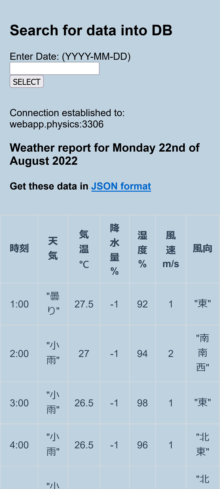

# REST API using PHP

Head to: 
## Endpoint: limit=int(number)

[Limit output](http://webapp.physics/rest-api/index.php/datos/list?limit=10)

It should display weather data (up to 10) 
~~However the output has some characters that cannot be JSON parsed, thus it throws the following: 
SyntaxError: JSON.parse: unexpected character at line 1 column 1 of the JSON data.~~

The above was due to I put *var_dump* somewhere in the code by removing it, JSON file is just fine.

## Endpoint: thisDate=str(YYYY-MM-DD)

[Sort by date](http://webapp.physics/rest-api/index.php/datos/thisDate=2022-08-29)

~~The above api has a bug, it does not return the requested date, instead returns data for already setup date(inside code).~~

## Access Page

I also made a [simple page](http://webapp.physics/rest-api/get_data.php) to actually display requested data and ease on the display.

## Needed features

Although GET is possible, the follow is needed: 
1. POST: Update DB by uploading CSV file
2. DELETE: Remove records from DB
3. Obviusly a *login page* is needed to perform the above.

---

## PHP help
Found on stuckUnderFlow (by Mayur Shah): 
PHP usually works by executing any bits of code and printing all output directly to the browser. If you say "echo 'Some text here.';", that string will get sent the browser and is emptied from memory. 
What output buffering does is say "Print all output to a buffer. Hold onto it. Don't send ANYTHING to the browser until I tell you to." 
So what this does is it buffers all your pages' HTML into the buffer, then at the very end, after the tag, it uses ob_get_contents() to get the contents of the buffer (which is usually all your page's HTML source code which would have been sent the browser already) and puts that into a string. 
ob_end_clean() empties the buffer and frees some memory. We don't need the source code anymore because we just stored it in $pageContents. 
Then, lastly, by doing a simple find & replace on your page's source code ($pageContents) for any instances of '' and replace them to whatever the $pageTitle variable was set to. Of course, it will then replace <title><!--TITLE--></title> with Your Page's Title. After that, echo the $pageContents, just like the browser would have.

---
## Running Environment
Server: Debian 11 on WSL, Apache2, Mariadb, PHP 7.2 
Languages: PHP, Python, JavaScript, Shell 
Editors: VIM and VSCode
